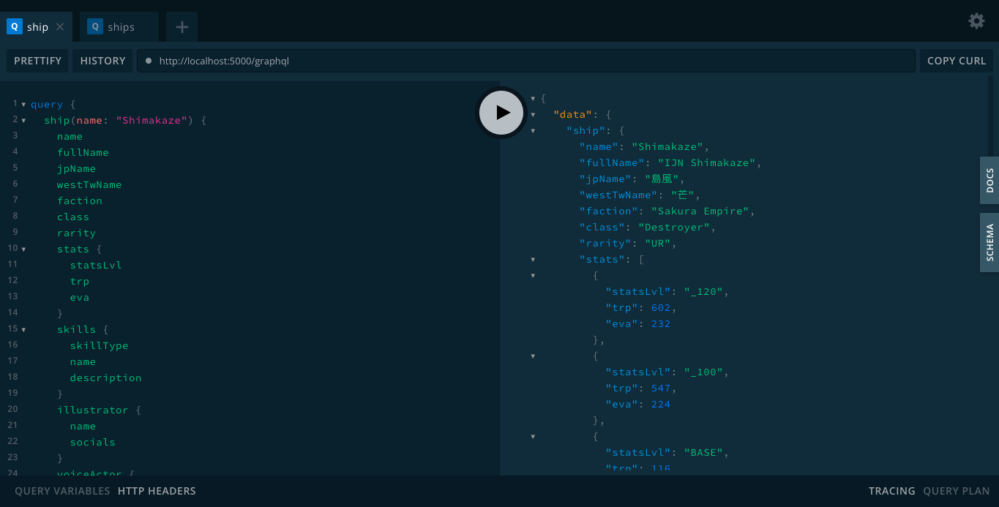

```
This repo is used for learning purposes.
```

## What I've Learned:

- [TypeScript](https://www.typescriptlang.org/docs)
- [GraphQL](https://www.graphql.org/learn)
- [NestJS](https://docs.nestjs.com)
- I suck balls at web scrapping

# botedb-gql



Azur Lane ship data served as GraphQL API. All of the data are fetched from [Azur Lane Wiki](https://azurlane.koumakan.jp/Azur_Lane_Wiki).

# Development

With docker container

```sh
$ cp .env.example .env && yarn docker:dev
```

or without it

```sh
$ cp .env.example .env && yarn start:dev
```

Then visit the GraphQL playground at http://localhost:5000/graphql

# Credits

- Shanghai Manjuu, Xiamen Yongshi, Shanghai Yostar
- [Azur Lane Wiki](https://azurlane.koumakan.jp/Azur_Lane_Wiki)
